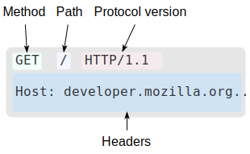

HTTP协议是Web上进行数据交换的基础。同事，也是一种客户端——服务器(client-server)协议
客户端与服务端通过交换一个个独立的消息进行通信。由客户端发出的消息被称作**请求(request)**，而服务端的则被称作**响应(response)**

HTTP是一种应用层的协议，通过==TCP==或==TLS==来发送。
### HTTP报文
有两种HTTP报文的类型，请求(request)与响应(response)
#### 请求
HTTP 请求的一个例子：
请求由以下元素组成：
- HTTP方法，如GET/POST
- 要获取的资源的路径
- HTTP协议版本号
- 为服务端表达其他信息的可选标头
- 请求体body
#### 响应
HTTP 响应的一个例子：
响应报文包含以下元素：
- HTTP协议版本号
- 状态码
- 状态信息
- HTTP标头，与请求标头类型 
- 可选项，一个包含了被获取资源的主体
