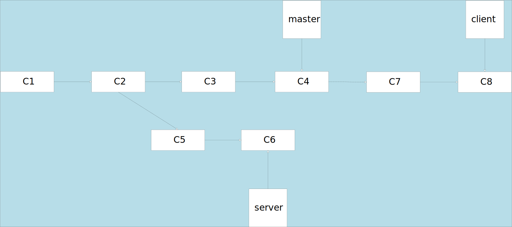

要把更改从一个分支整合到另一个分支，除了使用merge命令进行三方合并以外，还可以将提交的更改以补丁形式应用到分支的提交上。使用==rebase==命令
可以通过==`git rebase [basebranch] [topicbranch]`== 直接对topicbranch进行变基操作，而无需切换到该分支。`git rebase master test`
```
//切换到要被整合的分支上
git checkout test
git rebase master
```
工作原理：
找到test分支和master，然后获取test分支上每次提交引入的更改(diff)，将这些更改保存位临时文件，再将这些更改依次引入master分支。然后master分支进行快速合并(fast-forward merge)

变基是将某条开发分支线上的工作在另一个分支线上按顺序复现。

#### 跳过分支进行变基
`git rebase --onto master server client`
将当前分支切换到client分支，然后找出server和client分支的共同祖先提交，然后把自从共同祖先提交以来client分支上的提交在master分支上重现
现有三个分支，如图下



之后就可以快进合并，然后删除无用分支了。

#### 潜在危害
其缺点总结为一句话：==不要对已经存在于本地仓库以外得提交执行变基操作==
这是因为执行变基操作时，实际上是抛弃了已有的某些提交，随后在另一个分支创建了新的对应提交。实际上是不同的提交。
例如：你将你的提交推送到服务器，然后其他人拉取了这些内容。随后你对这个提交执行了变基操作并重新推送。这时其他人就不得不重新拉取整合，十分麻烦。
#### 只在需要的时候执行变基操作
Git除了会计算提交的SHA-1校验和，还会计算提交引入的补丁(patch)的校验和，这叫作patch-id
==git rebase teamone/master==，Git会判断那些是你的提交，并将它应用到新的分支去。

总而言之，不要对本地以外的分支进行变基操作，要把变基操作看作是在推送数据整理和处理提交的一个手段。